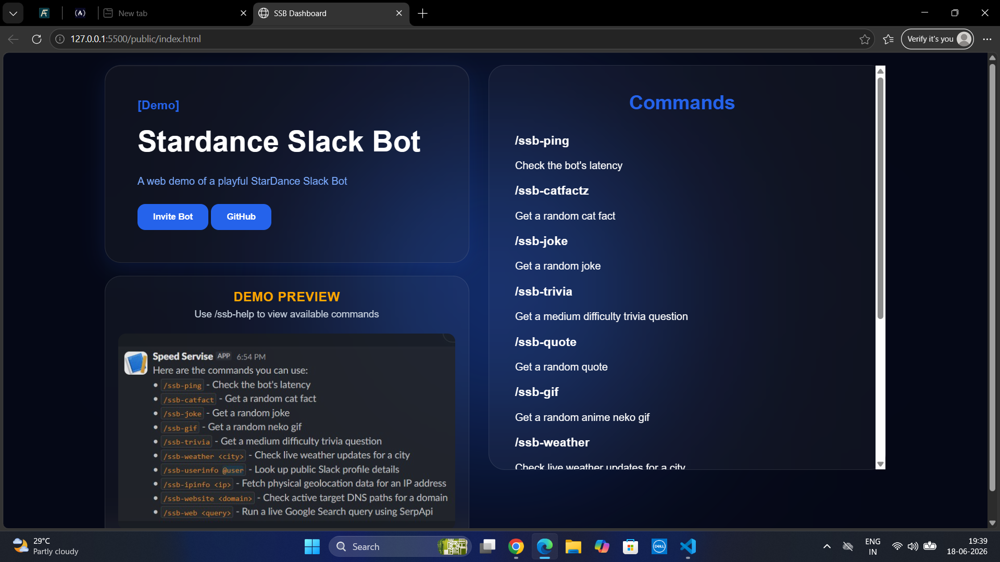

# StarDance Slack Bot
**Hey Coder**
This is my **Slack Bot** project. I used **Node.js** to perform backend, **web APIs** to get my response and **Nest** to run my bot 24/7. I also made a Demo website for my bot.

# My Demo site 

#My Slack Bot Channel
<video src="public/Inages/slack.mp4" width="100%" controls></video>

#Try My Demo
You should have joined **Hack Club Workspace**
Join My [Slack channel](https://hackclub.enterprise.slack.com/archives/C0BBWNK0WGZ)

# Features
* You can use any command listed in **Demo Site** or use **/ssb-help** in Slack channel.
* Send slash Command and get response.
* Entartain yourself, Challange yourself or use it for your search.

## Run Locally

1. Clone the repository:

git clone https://github.com/SanjayBinayak/my-slack-bot.git
cd my-slack-bot

2. Install dependencies:

npm install

3. Create a `.env` file and add your Slack and API credentials:

SLACK_BOT_TOKEN=your_bot_token
SLACK_APP_TOKEN=your_app_token
OPENAI_API_KEY=your_api_key

4. Start the application:

node index.js

5. Use it:

you can now use your commands in your slack.
you can also visit your demo site.

<<<<<<< HEAD
**I declare that I used AI and StarDance Guide to make some content of this project**
=======
**I declare that I used AI and StarDance Guide to make some content of this project**
>>>>>>> origin/main
